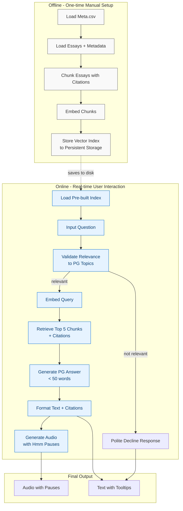

# Design Doc: AI Paul Graham Chatbot

> Please DON'T remove notes for AI

## Requirements

> Notes for AI: Keep it simple and clear.
> If the requirements are abstract, write concrete user stories

I want to create a chat bot with knowledge and perspective of Paul Graham, using his essays as knowledge source. The essays are in the ./data folder, with meta.csv providing essay metadata (titles, dates, URLs).

**User Stories:**

1. As a user, I can ask questions about startups, programming, or life philosophy
2. As a user, I receive answers in Paul Graham's distinctive tone and style
3. As a user, I can see which essays the answer came from via citations/tooltips
4. As a user, I can listen to the answer with Paul Graham's characteristic "hmm" pauses
5. As a user, I'm politely redirected if my question is outside Paul Graham's expertise

**Technical Requirements:**

- Use RAG (Retrieval Augmented Generation) for knowledge retrieval
- Break essays into small text chunks with metadata preservation
- Retrieve top 5 most relevant chunks when answering questions
- Generate concise responses (< 50 words) in Paul Graham's tone
- Add configurable "hmm" pauses to TTS (0-5 scale, default: 2)
- Include source citations with essay titles and context

## Flow Design

> Notes for AI:
>
> 1. Consider the design patterns of agent, map-reduce, rag, and workflow. Apply them if they fit.
> 2. Present a concise, high-level description of the workflow.

### Applicable Design Pattern:

**RAG (Retrieval Augmented Generation)** - Two-stage pipeline:

1. **Offline Stage (One-time Manual Setup)**: Process and index all Paul Graham essays for retrieval
2. **Online Stage (Real-time User Interaction)**: Answer user questions using pre-built index

### Flow high-level Design:

**Offline Flow (Indexing)**:

1. **Load Meta Node**: Read essay metadata from meta.csv
2. **Load Essays Node**: Read essay files and merge with metadata
3. **Chunk Essays Node**: Break essays into contextual chunks with citation info
4. **Embed Chunks Node**: Create vector embeddings for each chunk
5. **Store Index Node**: Save embeddings and metadata to local vector database

_Note: The backend flow is run manually when setting up the system or when new essays are added to the ./data folder._

**Online Flow (Real-time User Interaction)**:

1. **Load Index Node**: Load pre-built vector index from persistent storage
2. **Input Question Node**: Capture user question
3. **Validate Relevance Node**: Check if question relates to PG's expertise areas
4. **Embed Query Node**: Convert question to vector embedding
5. **Retrieve Chunks Node**: Find top 5 most relevant chunks with citations
6. **Generate Answer Node**: Create Paul Graham-style response using retrieved context
7. **Format Response Node**: Add citations and prepare text output
8. **Generate Audio Node**: Create TTS with scaled "hmm" pauses

_Note: This flow runs each time a user asks a question, using the pre-built index from the offline process._



## Utility Functions

> Notes for AI:
>
> 1. Understand the utility function definition thoroughly by reviewing the doc.
> 2. Include only the necessary utility functions, based on nodes in the flow.

1. **Load Meta** (`utils/load_meta.py`)

   - _Input_: meta_csv_path (str)
   - _Output_: dict mapping filenames to metadata
   - Used by Load Meta node to read essay metadata

2. **Load Essays** (`utils/file_loader.py`)

   - _Input_: data_directory (str), meta_dict (dict)
   - _Output_: list of essays with enriched metadata
   - Used by Load Essays node to read and merge essay content with metadata

3. **Chunk Text** (`utils/chunking.py`)

   - _Input_: essay (dict), chunk_size (int), overlap (int)
   - _Output_: list of chunks with citation metadata
   - Used by Chunk Essays node to create contextual chunks

4. **Get Embedding** (`utils/get_embedding.py`)

   - _Input_: text (str)
   - _Output_: vector embedding (list of floats)
   - _Model_: Google text-embedding-005
   - Used by Embed Chunks and Embed Query nodes

5. **Create Vector Index** (`utils/vector_db.py`)

   - _Input_: embeddings (list), chunks_metadata (list)
   - _Output_: vector index object
   - Used by Store Index node to create searchable index

6. **Load Vector Index** (`utils/load_index.py`)

   - _Input_: index_path (str)
   - _Output_: vector index object, chunks_metadata (list)
   - Used by Load Index node to load pre-built index from persistent storage

7. **Search Vector Index** (`utils/vector_search.py`)

   - _Input_: query_embedding (list), index (object), top_k (int)
   - _Output_: list of relevant chunks with similarity scores
   - Used by Retrieve Chunks node for similarity search

8. **Validate Question** (`utils/validate_relevance.py`)

   - _Input_: question (str)
   - _Output_: boolean (is_relevant)
   - Used by Validate Relevance node to check topic relevance

9. **Call LLM** (`utils/call_llm.py`)

   - _Input_: prompt (str)
   - _Output_: response (str)
   - _Model_: Vertex AI Claude 3.7
   - Used by Generate Answer node for Paul Graham-style responses

10. **Add Pauses** (`utils/pause_processor.py`)

    - _Input_: text (str), pause_scale (int 0-5)
    - _Output_: text with pause markers
    - Used by Generate Audio node to insert "hmm" pauses

11. **Text to Speech** (`utils/tts.py`)
    - _Input_: text_with_pauses (str)
    - _Output_: audio file path (str)
    - _Model_: Google CHIRP3
    - Used by Generate Audio node for final TTS conversion

## Data Design

### Shared Store

> Notes for AI: Try to minimize data redundancy

The shared store structure is organized as follows:

```python
shared = {
    # Configuration
    "config": {
        "data_dir": "./data",
        "meta_csv": "./meta.csv",
        "index_path": "./vector_index",  # Persistent storage location
        "pause_scale": 2,           # TTS pause scale (0-5)
        "max_chunks": 5,            # Number of chunks to retrieve
        "chunk_size": 500,          # Text chunk size
        "chunk_overlap": 100        # Overlap between chunks
    },

    # Offline Processing Data (One-time Setup)
    "meta_dict": {},                # Essay metadata from CSV
    "essays": [],                   # Essays with metadata
    "chunks": [],                   # Text chunks with citation info
    "embeddings": [],               # Vector embeddings (paired with chunks)
    "vector_index": None,           # Searchable vector index

    # Online Processing Data (Per User Question)
    "chunks_metadata": [],          # Loaded chunk metadata (from Load Index)
    "user_question": "",            # Current user question
    "is_relevant": False,           # Question relevance validation result
    "decline_reason": "",           # Reason if question declined
    "query_embedding": [],          # Question vector embedding
    "retrieved_chunks": [],         # Top chunks with similarity scores
    "generated_answer": "",         # Raw LLM response
    "text_with_pauses": "",         # Text processed with pause markers
    "formatted_response": {         # Final formatted output
        "text": "",                 # Text with citations and tooltips
        "citations": [],            # Source references for tooltips
        "audio_path": ""            # TTS audio file path
    }
}
```

### Enhanced Data Structures

**Essay Structure:**

```python
{
    "filename": "startupideas.txt",
    "title": "How to Get Startup Ideas",
    "date": "2012-11",
    "url": "http://paulgraham.com/startupideas.html",
    "content": "The way to get startup ideas is not to try..."
}
```

**Chunk Structure:**

```python
{
    "text": "The way to get startup ideas is not to try to think of startup ideas...",
    "essay_title": "How to Get Startup Ideas",
    "essay_filename": "startupideas.txt",
    "essay_url": "http://paulgraham.com/startupideas.html",
    "chunk_index": 0,
    "start_pos": 0,
    "end_pos": 500,
    "embedding": []                 # Vector embedding (populated during offline processing)
}
```

**Retrieved Chunk Structure (with similarity):**

```python
{
    "text": "The way to get startup ideas is not to try to think of startup ideas...",
    "essay_title": "How to Get Startup Ideas",
    "essay_filename": "startupideas.txt",
    "essay_url": "http://paulgraham.com/startupideas.html",
    "chunk_index": 0,
    "similarity_score": 0.87,       # Cosine similarity score (0-1)
    "rank": 1                       # Ranking in retrieved results (1-5)
}
```

**Citation Structure:**

```python
{
    "citation_id": "cite_1",
    "essay_title": "How to Get Startup Ideas",
    "essay_url": "http://paulgraham.com/startupideas.html",
    "chunk_text": "The way to get startup ideas is not to try...",
    "relevance_score": 0.87         # For ranking citations by relevance
}
```

## Node Design

### Node Steps

> Notes for AI: Carefully decide whether to use Batch/Async Node/Flow.

**Offline Flow Nodes:**

1. **Load Meta Node**

   - _Purpose_: Read essay metadata from meta.csv
   - _Type_: Regular
   - _Steps_:
     - _prep_: Read meta.csv path from config
     - _exec_: Call load_meta utility function
     - _post_: Write meta_dict to shared store

2. **Load Essays Node**

   - _Purpose_: Read essay files and merge with metadata
   - _Type_: Batch
   - _Steps_:
     - _prep_: Read data directory and meta_dict from shared store
     - _exec_: Call file_loader utility for each essay file
     - _post_: Write essays list to shared store

3. **Chunk Essays Node**

   - _Purpose_: Break essays into contextual chunks with citation metadata
   - _Type_: Batch
   - _Steps_:
     - _prep_: Read essays from shared store
     - _exec_: Call chunk_text utility for each essay
     - _post_: Write flattened chunks list to shared store

4. **Embed Chunks Node**

   - _Purpose_: Create vector embeddings for all chunks
   - _Type_: Batch
   - _Steps_:
     - _prep_: Read chunks from shared store
     - _exec_: Call get_embedding utility for each chunk text
     - _post_: Write embeddings list to shared store

5. **Store Index Node**
   - _Purpose_: Create and save vector database index
   - _Type_: Regular
   - _Steps_:
     - _prep_: Read embeddings and chunks from shared store
     - _exec_: Call create_vector_index utility
     - _post_: Write vector_index to shared store

**Online Flow Nodes:**

6. **Load Index Node**

   - _Purpose_: Load pre-built vector index from persistent storage
   - _Type_: Regular
   - _Steps_:
     - _prep_: Read index path from config
     - _exec_: Call load_vector_index utility function
     - _post_: Write vector_index and chunks_metadata to shared store

7. **Input Question Node**

   - _Purpose_: Capture and store user question
   - _Type_: Regular
   - _Steps_:
     - _prep_: No preparation needed
     - _exec_: Get question from user input or API
     - _post_: Write user_question to shared store

8. **Validate Relevance Node**

   - _Purpose_: Check if question relates to Paul Graham's expertise
   - _Type_: Regular
   - _Steps_:
     - _prep_: Read user_question from shared store
     - _exec_: Call validate_question utility
     - _post_: Write is_relevant flag, return "relevant" or "decline" action

9. **Embed Query Node**

   - _Purpose_: Convert user question to vector embedding
   - _Type_: Regular
   - _Steps_:
     - _prep_: Read user_question from shared store
     - _exec_: Call get_embedding utility
     - _post_: Write query_embedding to shared store

10. **Retrieve Chunks Node**

    - _Purpose_: Find top 5 most relevant chunks with citation info
    - _Type_: Regular
    - _Steps_:
      - _prep_: Read query_embedding, vector_index, and config from shared store
      - _exec_: Call search_vector_index utility
      - _post_: Write retrieved_chunks to shared store

11. **Generate Answer Node**

    - _Purpose_: Create Paul Graham-style response using retrieved context
    - _Type_: Regular
    - _Steps_:
      - _prep_: Read user_question and retrieved_chunks from shared store
      - _exec_: Call call_llm utility with PG prompt template
      - _post_: Write generated_answer to shared store

12. **Format Response Node**

    - _Purpose_: Add source citations and prepare final text output
    - _Type_: Regular
    - _Steps_:
      - _prep_: Read generated_answer and retrieved_chunks from shared store
      - _exec_: Format text with citations and tooltips
      - _post_: Write formatted text and citations to shared store

13. **Generate Audio Node**
    - _Purpose_: Create TTS audio with scaled "hmm" pauses
    - _Type_: Regular
    - _Steps_:
      - _prep_: Read formatted text and pause_scale from shared store
      - _exec_: Call add_pauses utility, then tts utility
      - _post_: Write audio_path to formatted_response

**Pause Scale Implementation:**

- **0**: No pauses added
- **1**: Light pauses (every 3rd sentence ending)
- **2**: Moderate pauses (every 2nd sentence ending) - **DEFAULT**
- **3**: Regular pauses (most sentence endings)
- **4**: Frequent pauses (all sentence endings)
- **5**: Maximum pauses (multiple "hmm"s + longer pauses)

**Relevance Validation Topics:**

- ✅ Startups, entrepreneurship, business strategy
- ✅ Programming, technology, software development
- ✅ Essays, writing, communication
- ✅ Education, learning, intellectual curiosity
- ✅ Life philosophy, productivity, decision-making
- ❌ Medical advice, legal advice, current politics
- ❌ Personal information about Paul Graham
- ❌ Technical support for specific products
